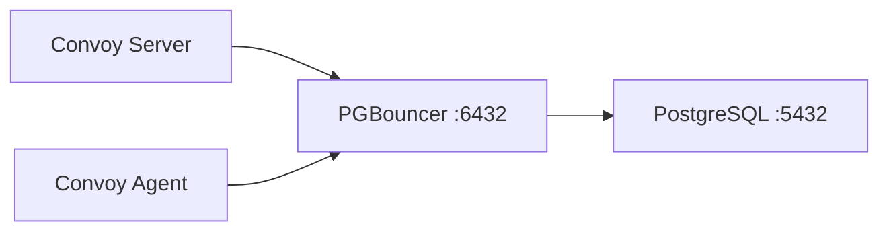

PostgreSQL is Convoy's sole data store and search backend. How you deploy and connect to it directly affects throughput, latency, and reliability. This guide covers the recommended approach -- using a cloud-managed PostgreSQL service -- and an alternative path for teams that choose to self-host PostgreSQL with PGBouncer as a connection pooler.

## Recommended: Cloud-Managed PostgreSQL

<Note>
**This is the recommended approach for production deployments.** A managed PostgreSQL service handles the hardest parts of database operations for you, letting you focus on running Convoy rather than maintaining infrastructure.
</Note>

Cloud-managed PostgreSQL services provide:

- **Automated backups** with point-in-time recovery
- **High availability** with automatic failover
- **Security patching** applied without downtime
- **Built-in connection pooling** so you don't need to deploy PGBouncer separately
- **Autovacuum management** tuned for the provider's workload patterns
- **Monitoring and alerting** out of the box

### Providers with Built-In Connection Pooling

Most managed PostgreSQL providers include a connection pooler that you can enable without deploying additional infrastructure:

| Provider | Connection Pooler | Notes |
|----------|------------------|-------|
| AWS RDS / Aurora | RDS Proxy | Separate service; supports transaction-mode pooling |
| GCP Cloud SQL | Built-in connection pooling | Configurable via the Cloud SQL console |
| Azure Database for PostgreSQL | Built-in PgBouncer | Enable in server parameters |
| Aiven | Built-in connection pooling | Available on all plans |
| Supabase | Supavisor | Built-in; transaction mode supported |
| Neon | Built-in connection pooling | Enabled by default |

If your provider's pooler supports **transaction pooling mode**, enable it. Transaction mode returns connections to the pool after each transaction, allowing many Convoy processes to share a smaller number of database connections. If only session mode is available, the pooler still works but provides less benefit -- you may want to add PGBouncer in front (see the self-hosted section below).

### Configuring Convoy for a Managed Service

Point Convoy's database configuration at your managed PostgreSQL endpoint. Most managed services require TLS:

```bash Environment Variables
CONVOY_DB_HOST=your-instance.rds.amazonaws.com
CONVOY_DB_PORT=5432
CONVOY_DB_USERNAME=convoy
CONVOY_DB_PASSWORD=your_password
CONVOY_DB_DATABASE=convoy
CONVOY_DB_OPTIONS="sslmode=require&connect_timeout=30"
```

```json convoy.json
{
  "database": {
    "host": "your-instance.rds.amazonaws.com",
    "port": 5432,
    "username": "convoy",
    "password": "your_password",
    "database": "convoy",
    "options": "sslmode=require&connect_timeout=30"
  }
}
```

If your provider exposes a separate pooler endpoint (e.g., RDS Proxy or a PgBouncer endpoint on a different port), point Convoy at that endpoint instead of the direct database endpoint.

See the [Configuration Reference](/deployment/configuration#configuration-reference) for all database parameters including connection pool tuning (`max_open_conn`, `max_idle_conn`, `conn_max_lifetime`). For Kubernetes deployments using Helm, see [Kubernetes -- managed Postgres](/deployment/install-convoy/kubernetes#example-managed-postgres-rds-cloudsql-etc).

---

## Self-Hosted PostgreSQL with PGBouncer

<Note>
**Self-hosting PostgreSQL means you are responsible for backups, failover, security patching, disk space management, and autovacuum tuning.** If any of these are not in place, we strongly recommend migrating to a managed PostgreSQL service before scaling further. A missed autovacuum can cause transaction ID wraparound -- a catastrophic failure mode. Unmonitored WAL files and table bloat can fill disks silently.
</Note>

### Why PGBouncer?

Convoy's worker and server processes open many concurrent database connections when processing events at scale. Each Convoy process defaults to 10 open connections. A typical deployment with a server and several agent replicas can quickly approach PostgreSQL's `max_connections` limit, leading to errors like:

```
FATAL: no more connections allowed (max_client_conn)
FATAL: query_wait_timeout
```

PGBouncer sits between Convoy and PostgreSQL, multiplexing many client connections over a smaller pool of server connections:



PGBouncer is extremely lightweight (10-20 MB of RAM) and benefits from zero network latency when co-located on the same machine as PostgreSQL. For most deployments, running them on the same VM is the simplest and most effective setup.

### Connection Pooling Mode

<Note>
**PGBouncer must run in `transaction` pooling mode for Convoy.** Session pooling mode (the default) provides no benefit because each client session holds a dedicated PostgreSQL connection for its entire lifetime -- the same as connecting directly. In transaction mode, connections are returned to the pool after each transaction completes, allowing many clients to share a small number of server connections.
</Note>

If you have already deployed PGBouncer and see no improvement, the most common cause is that it is running in session mode. Verify with `SHOW POOLS;` and check the `pool_mode` column.

### Installing PGBouncer

<Tabs>
<Tab title="Docker / Docker Compose">

Create a directory for PGBouncer configuration:

```bash
mkdir -p /etc/convoy/pgbouncer
```

Create `/etc/convoy/pgbouncer/userlist.txt` with the SCRAM hash for your PostgreSQL user. To get the hash, connect directly to PostgreSQL and run:

```sql
SELECT usename, passwd FROM pg_shadow WHERE usename = 'convoy';
```

Then put the full SCRAM string in the file:

```
"convoy" "SCRAM-SHA-256$4096:<salt>$<storedkey>:<serverkey>"
```

Create `/etc/convoy/pgbouncer/.env`:

```env
POSTGRESQL_USER=convoy
POSTGRESQL_PASSWORD=your_postgres_password
POSTGRESQL_DATABASE=convoy
POSTGRESQL_HOST=your_postgres_host
POSTGRESQL_OPTIONS="sslmode=disable&connect_timeout=30"

PGBOUNCER_AUTH_TYPE=scram-sha-256
PGBOUNCER_USERLIST_FILE=/bitnami/userlists.txt
PGBOUNCER_DATABASE=${POSTGRESQL_DATABASE}
PGBOUNCER_AUTH_USER=convoy
PGBOUNCER_POOL_MODE=transaction
PGBOUNCER_MAX_CLIENT_CONN=500
PGBOUNCER_DEFAULT_POOL_SIZE=50
PGBOUNCER_MAX_DB_CONNECTIONS=250
PGBOUNCER_MAX_PREPARED_STATEMENTS=100
PGBOUNCER_IGNORE_STARTUP_PARAMETERS=extra_float_digits
```

Replace `your_postgres_host` and `your_postgres_password` with your actual values.

Add PGBouncer to your `docker-compose.yml`:

```yaml docker-compose.yml
services:
  pgbouncer:
    image: bitnami/pgbouncer:latest
    hostname: pgbouncer
    restart: unless-stopped
    ports:
      - "6432:6432"
    env_file:
      - /etc/convoy/pgbouncer/.env
    volumes:
      - /etc/convoy/pgbouncer/:/bitnami/pgbouncer/conf/
      - /etc/convoy/pgbouncer/userlist.txt:/bitnami/userlists.txt
```

Start PGBouncer:

```bash
docker compose up -d pgbouncer
```

</Tab>
<Tab title="Native (apt / yum)">

Install PGBouncer on the same machine as PostgreSQL:

```bash
# Ubuntu / Debian
sudo apt-get update && sudo apt-get install -y pgbouncer

# RHEL / CentOS
sudo yum install -y pgbouncer
```

Create the auth file at `/etc/pgbouncer/userlist.txt`. Most modern PostgreSQL instances use SCRAM-SHA-256 authentication, so you need the SCRAM hash rather than a plaintext password. Get it by connecting directly to PostgreSQL:

```sql
SELECT usename, passwd FROM pg_shadow WHERE usename = 'convoy';
```

Then put the full SCRAM string in the file:

```
"convoy" "SCRAM-SHA-256$4096:<salt>$<storedkey>:<serverkey>"
```

Configure PGBouncer by editing `/etc/pgbouncer/pgbouncer.ini` (see the configuration section below), then start it:

```bash
sudo systemctl enable pgbouncer
sudo systemctl start pgbouncer
```

</Tab>
</Tabs>

### PGBouncer Configuration

Whether you use Docker environment variables or a native `pgbouncer.ini`, these are the critical settings:

```ini pgbouncer.ini
[databases]
convoy = host=127.0.0.1 port=5432 dbname=convoy

[pgbouncer]
listen_addr = 0.0.0.0
listen_port = 6432

;; -------------------------------------------
;; Authentication
;; -------------------------------------------
;; Most modern PostgreSQL instances default to SCRAM-SHA-256.
;; PGBouncer must match the auth method your PostgreSQL uses.
auth_type = scram-sha-256
auth_file = /etc/pgbouncer/userlist.txt

;; auth_user + auth_query let PGBouncer look up credentials
;; from PostgreSQL directly. You only need to maintain the
;; SCRAM hash for this one user in userlist.txt; all other
;; users are authenticated dynamically via the query.
auth_user = convoy
auth_query = SELECT usename, passwd FROM pg_shadow WHERE usename = $1

;; CRITICAL: must be "transaction" for Convoy
pool_mode = transaction

;; Connection limits
max_client_conn = 500
default_pool_size = 50
max_db_connections = 250
min_pool_size = 10

;; Required: Convoy's pgx driver uses prepared statements
max_prepared_statements = 100

;; Required: pgx sets this parameter on connect
ignore_startup_parameters = extra_float_digits

;; Timeouts
query_wait_timeout = 30
server_idle_timeout = 300
client_idle_timeout = 600

;; Logging
log_connections = 0
log_disconnections = 0
log_pooler_errors = 1
```

If your PostgreSQL runs on a non-standard port, update the `[databases]` section accordingly (e.g., `port=20001`).

<Note>
**PostgreSQL `pg_hba.conf` must allow `scram-sha-256` for TCP connections.** PGBouncer connects to PostgreSQL over TCP (127.0.0.1), even when co-located on the same machine. If your `pg_hba.conf` uses `peer` or `pam` for local connections, PGBouncer will fail to authenticate. Ensure you have a rule like:

```
host all all 127.0.0.1/32 scram-sha-256
```

Reload PostgreSQL after changing `pg_hba.conf`: `sudo systemctl reload postgresql`
</Note>

#### Settings Reference

| Setting | Recommended | Description |
|---------|-------------|-------------|
| `auth_type` | `scram-sha-256` | **Required.** Must match your PostgreSQL authentication method. Most modern PostgreSQL instances default to SCRAM-SHA-256. |
| `auth_user` | `convoy` | The PostgreSQL user PGBouncer uses to run the `auth_query`. Its SCRAM hash must be in `auth_file`. |
| `auth_query` | `SELECT usename, passwd FROM pg_shadow WHERE usename = $1` | Lets PGBouncer authenticate users dynamically against PostgreSQL. `$1` is replaced with the connecting username. |
| `pool_mode` | `transaction` | **Required.** Session mode provides no pooling benefit for Convoy. |
| `max_prepared_statements` | `100` | **Required.** Convoy's database driver (pgx) uses prepared statements. Without this, queries fail in transaction mode. Requires PGBouncer 1.21+. |
| `ignore_startup_parameters` | `extra_float_digits` | **Required.** The pgx driver sets this parameter on connect; PGBouncer must ignore it. |
| `default_pool_size` | `50` | Server connections per database/user pair. Start with 2-4x your CPU count. |
| `max_client_conn` | `500` | Maximum client connections PGBouncer accepts. Must exceed total connections from all Convoy processes. |
| `max_db_connections` | `250` | Hard cap on connections to PostgreSQL. Must not exceed PostgreSQL's `max_connections`. |
| `min_pool_size` | `10` | Minimum idle connections to keep open, avoiding latency on traffic spikes. |

#### Tuning Pool Size

- **`default_pool_size`**: Start with 2-4x your CPU count (e.g., 50 for 8 vCPU, 75 for 32 vCPU). Monitor `cl_waiting` in `SHOW POOLS;` -- if clients are frequently waiting, increase the pool size.
- **`max_client_conn`**: Set to at least the sum of `max_open_conn` across all Convoy processes plus headroom. With Convoy's default of 10 connections per process: 1 server + 3 agents = 40 connections minimum. A setting of 300-500 provides comfortable headroom.
- **`max_db_connections`**: Must not exceed PostgreSQL's `max_connections` minus a buffer for superuser access and monitoring tools.

### Configuring Convoy to Use PGBouncer

Update Convoy's database configuration to connect through PGBouncer instead of directly to PostgreSQL. Change the port from `5432` to `6432` and point the host at the machine running PGBouncer:

```bash Environment Variables
CONVOY_DB_HOST=127.0.0.1    # or the PGBouncer host if on a different machine
CONVOY_DB_PORT=6432          # PGBouncer port, NOT the PostgreSQL port
CONVOY_DB_USERNAME=convoy
CONVOY_DB_PASSWORD=your_postgres_password
CONVOY_DB_DATABASE=convoy
CONVOY_DB_OPTIONS="sslmode=disable"
```

```json convoy.json
{
  "database": {
    "host": "127.0.0.1",
    "port": 6432,
    "username": "convoy",
    "password": "your_postgres_password",
    "database": "convoy",
    "options": "sslmode=disable"
  }
}
```

Restart all Convoy services (server, agent) after making this change. See the [Configuration Reference](/deployment/configuration#configuration-reference) for connection pool parameters (`max_open_conn`, `max_idle_conn`, `conn_max_lifetime`).

### Verifying the Setup

Test connectivity through PGBouncer:

```bash
psql -U convoy -h 127.0.0.1 -p 6432 -d convoy -c "SELECT 1;"
```

Check the pool status to verify transaction mode is active:

```bash
psql -U postgres -h 127.0.0.1 -p 6432 -d pgbouncer -c "SHOW POOLS;"
```

You should see output with `pool_mode = transaction`:

```
 database | user   | cl_active | cl_waiting | sv_active | sv_idle | pool_mode
----------+--------+-----------+------------+-----------+---------+-------------
 convoy   | convoy |         0 |          0 |         0 |       0 | transaction
```

If you see `session` instead of `transaction`, the configuration was not applied correctly. Re-check your `pgbouncer.ini` or Docker environment variables and restart PGBouncer.

---

## PostgreSQL Tuning

The settings below apply to self-hosted PostgreSQL. Managed services typically handle these automatically.

<AccordionGroup>
<Accordion title="Memory">

| Setting | Guideline | Example (8 vCPU / 32 GB) | Example (32 vCPU / 256 GB) |
|---------|-----------|---------------------------|----------------------------|
| `shared_buffers` | 25% of RAM | `8GB` | `64GB` |
| `effective_cache_size` | 75% of RAM | `24GB` | `192GB` |
| `work_mem` | Size per sort/join operation | `32MB` | `64MB` |
| `maintenance_work_mem` | Memory for VACUUM, CREATE INDEX | `1GB` | `2GB` |

`effective_cache_size` is not an allocation -- it tells the query planner how much memory is available for caching, which affects query plan choices.

</Accordion>
<Accordion title="WAL & Checkpoints">

```ini postgresql.conf
wal_buffers = 64MB               # 256MB for high-throughput workloads
min_wal_size = 2GB
max_wal_size = 8GB
checkpoint_completion_target = 0.9
```

Spreading checkpoint writes with `checkpoint_completion_target = 0.9` avoids I/O spikes. Enable `log_checkpoints = on` to monitor checkpoint frequency.

</Accordion>
<Accordion title="Autovacuum (Critical)">

Autovacuum **must** be enabled -- never disable it. Convoy's write-heavy workload generates dead tuples that autovacuum must clean up. If autovacuum falls behind, tables bloat, queries slow down, and in the worst case, transaction ID wraparound can cause a full database shutdown.

```ini postgresql.conf
autovacuum = on
autovacuum_max_workers = 6
autovacuum_vacuum_scale_factor = 0.05
autovacuum_analyze_scale_factor = 0.025
autovacuum_vacuum_cost_limit = 2000
```

For Convoy's busiest tables, you can set more aggressive per-table thresholds:

```sql
ALTER TABLE convoy.events SET (autovacuum_vacuum_scale_factor = 0.01);
ALTER TABLE convoy.event_deliveries SET (autovacuum_vacuum_scale_factor = 0.01);
```

Monitor autovacuum by enabling `log_autovacuum_min_duration = 250` in `postgresql.conf`.

</Accordion>
<Accordion title="Connection Limits">

```ini postgresql.conf
max_connections = 300
```

`max_connections` must be greater than or equal to PGBouncer's `max_db_connections` plus a buffer for superuser access and monitoring tools. Check your current setting:

```sql
SHOW max_connections;
```

</Accordion>
<Accordion title="Query Planner (SSD Storage)">

If your VM uses SSD-backed storage, these settings improve query plans:

```ini postgresql.conf
random_page_cost = 1.1            # default 4.0 is for spinning disks
effective_io_concurrency = 200    # concurrent I/O operations for SSDs
```

</Accordion>
<Accordion title="Parallelism">

For VMs with many cores, allow parallel query execution:

```ini postgresql.conf
max_worker_processes = 16
max_parallel_workers_per_gather = 4
max_parallel_workers = 16
max_parallel_maintenance_workers = 4
```

Scale these values based on your CPU count. A reasonable starting point is to set `max_parallel_workers` to half your vCPU count.

</Accordion>
</AccordionGroup>

After changing `postgresql.conf`, restart PostgreSQL:

```bash
sudo systemctl restart postgresql
```

---

## Monitoring

### PGBouncer Health

Connect to the PGBouncer admin console and run `SHOW POOLS;` regularly:

```bash
psql -U postgres -h 127.0.0.1 -p 6432 -d pgbouncer
```

```sql
SHOW POOLS;
SHOW CLIENTS;
SHOW SERVERS;
SHOW STATS;
```

| Metric | Healthy | Action |
|--------|---------|--------|
| `cl_waiting` | 0 | If consistently > 0, increase `default_pool_size` |
| `maxwait` | < 1s | If high, increase pool size or investigate slow queries |
| `sv_active` | < `default_pool_size` | If at the limit, increase `default_pool_size` |
| `cl_active` | < `max_client_conn` | If at the limit, increase `max_client_conn` |

### PostgreSQL Health

```sql
-- Active connections by state
SELECT state, count(*) FROM pg_stat_activity GROUP BY state;

-- Long-running queries (anything over 30s is a concern)
SELECT pid, now() - query_start AS duration, query
FROM pg_stat_activity
WHERE state = 'active' AND now() - query_start > interval '30 seconds'
ORDER BY duration DESC;

-- Table bloat and vacuum status
SELECT schemaname, relname, n_dead_tup, last_autovacuum
FROM pg_stat_user_tables
ORDER BY n_dead_tup DESC
LIMIT 20;

-- Connection usage percentage
SELECT count(*) AS total_connections,
       max_conn AS max_connections,
       round(count(*)::numeric / max_conn * 100, 1) AS usage_pct
FROM pg_stat_activity,
     (SELECT setting::int AS max_conn FROM pg_settings WHERE name = 'max_connections') s
GROUP BY max_conn;
```

---

## Troubleshooting

<Accordion title="No improvement after adding PGBouncer">
  1. **Verify pool mode**: Connect to PGBouncer admin and run `SHOW POOLS;`. The `pool_mode` column must show `transaction`, not `session`. Session mode provides no pooling benefit.
  2. **Verify Convoy is connecting to PGBouncer**: Convoy must connect to port `6432` (PGBouncer), not `5432` (PostgreSQL directly). Check your `CONVOY_DB_PORT` setting.
  3. **Verify prepared statements**: Ensure `max_prepared_statements` is set to `100` in PGBouncer's configuration. Without it, queries may fail silently in transaction mode.
</Accordion>

<Accordion title="FATAL: no more connections allowed (max_client_conn)">
  PGBouncer has hit its client connection limit. Increase `max_client_conn` in your PGBouncer configuration and restart or reload PGBouncer:

  ```bash
  # Native install
  sudo systemctl reload pgbouncer

  # Docker
  docker restart pgbouncer
  ```
</Accordion>

<Accordion title="FATAL: query_wait_timeout">
  Clients are waiting too long for a server connection from the pool. Either:
  - Increase `default_pool_size` to allow more concurrent server connections
  - Check for long-running queries in PostgreSQL that are holding connections:

  ```sql
  SELECT pid, now() - query_start AS duration, query
  FROM pg_stat_activity
  WHERE state = 'active'
  ORDER BY duration DESC;
  ```
</Accordion>

<Accordion title="Prepared statement errors">
  If you see `prepared statement does not exist` errors, ensure `max_prepared_statements` is set to `100` (or higher) in PGBouncer's configuration. This setting is required for PGBouncer 1.21+ when using transaction pooling mode, because Convoy's database driver (pgx) uses prepared statements by default.
</Accordion>

<Accordion title="Connection refused on port 6432">
  Verify PGBouncer is running:

  ```bash
  # Docker
  docker ps | grep pgbouncer
  docker logs pgbouncer

  # Native
  sudo systemctl status pgbouncer
  journalctl -u pgbouncer
  ```

  Check that `listen_addr` and `listen_port` are configured correctly, and that firewall rules allow traffic on port 6432.
</Accordion>

<Accordion title="SASL authentication failed / wrong password type">
  This usually means a mismatch between PGBouncer's `auth_type` and the password format stored in PostgreSQL or `userlist.txt`:

  - **PostgreSQL uses SCRAM but PGBouncer is set to `md5`**: Set `auth_type = scram-sha-256` in PGBouncer. SCRAM and MD5 hashes are not interchangeable.
  - **Truncated SCRAM hash in `userlist.txt`**: The SCRAM string is long and easy to truncate. Verify the full hash with `SELECT usename, passwd FROM pg_shadow WHERE usename = 'convoy';` and ensure it matches exactly.
  - **`auth_user` cannot authenticate**: When using `auth_query`, PGBouncer must first authenticate the `auth_user` itself via `auth_file`. Ensure the `auth_file` contains the correct SCRAM hash for that user.
</Accordion>

<Accordion title="PAM authentication failed">
  This means PostgreSQL's `pg_hba.conf` is using PAM authentication for TCP connections. PGBouncer connects via TCP (127.0.0.1), even when co-located. Update `pg_hba.conf` to use `scram-sha-256` instead of `pam`:

  ```
  host all all 127.0.0.1/32 scram-sha-256
  ```

  Then reload PostgreSQL: `sudo systemctl reload postgresql`
</Accordion>

<Accordion title="High dead tuple count on Convoy tables">
  Autovacuum is not keeping up with Convoy's write volume. Increase `autovacuum_vacuum_cost_limit` in `postgresql.conf` or add per-table autovacuum settings:

  ```sql
  ALTER TABLE convoy.events SET (autovacuum_vacuum_scale_factor = 0.01);
  ALTER TABLE convoy.event_deliveries SET (autovacuum_vacuum_scale_factor = 0.01);
  ```
</Accordion>
