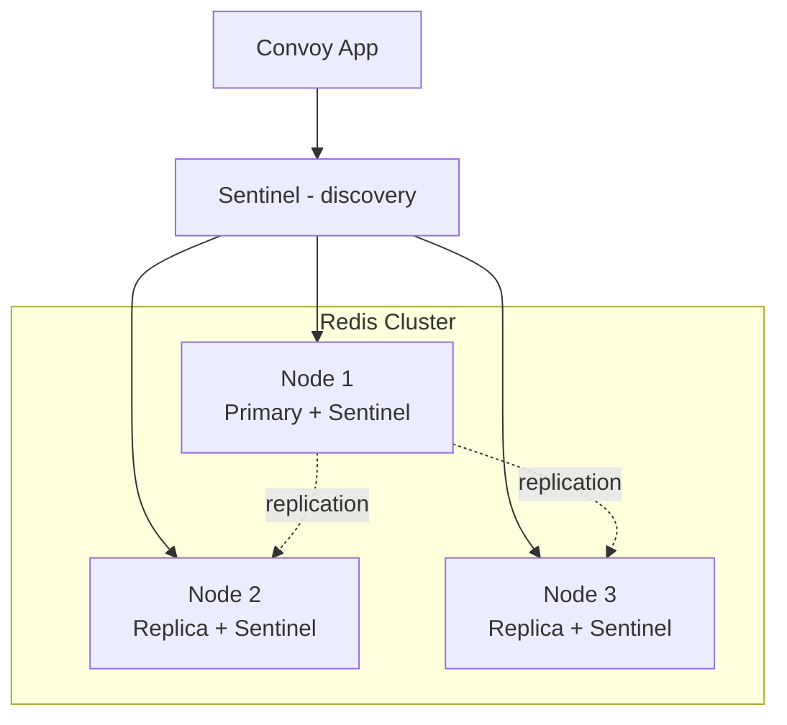

Convoy depends on Redis for the task queue, rate limiting, circuit breaker state, and caching. Because the task queue and circuit breaker state must survive restarts, Redis persistence and high availability matter for production deployments. This guide covers the recommended approach -- using a cloud-managed Redis service -- and an alternative path for teams that choose to self-host Redis with Sentinel for high availability.

## How Convoy Uses Redis

| Function | Description | Data Characteristics |
|----------|-------------|---------------------|
| **Task Queue** (Asynq) | All event processing jobs are enqueued and dequeued through Redis | High write throughput, must survive restarts |
| **Rate Limiting** | Per-endpoint rate limit counters | High read/write, short-lived keys |
| **Circuit Breaker** | Tracks endpoint health for circuit breaking | Moderate read/write, must survive restarts |
| **Caching** | Project, endpoint, subscription lookups | High read, tolerates loss on failover |

Because the task queue and circuit breaker state live in Redis, **persistence is required**. A Redis restart without persistence (or without HA) means in-flight jobs are lost.

## Recommended: Cloud-Managed Redis

<Note>
**This is the recommended approach for production deployments.** A managed Redis service handles the hardest parts of running Redis at scale -- HA, failover, persistence, security patching, backups, and monitoring -- so you can focus on running Convoy.
</Note>

Cloud-managed Redis services provide:

- **Automatic failover** with multi-AZ replicas
- **Persistence and backups** without you managing RDB/AOF directly
- **Security patching** applied without downtime
- **TLS-encrypted endpoints** out of the box
- **Monitoring and alerting** built in
- **Memory and CPU autoscaling** on most providers

### Providers

| Provider | Mode | Notes |
|----------|------|-------|
| AWS ElastiCache | Cluster mode or replication group with primary endpoint | Replication groups support automatic failover; cluster mode is also supported by Convoy |
| GCP Memorystore | Standalone or HA tier | HA tier provides automatic failover |
| Azure Managed Redis / Azure Cache for Redis | Standalone, Replication, or Cluster | Premium and Enterprise tiers offer HA |
| Aiven for Redis | HA across nodes | Simple connection endpoint |
| Upstash | Serverless Redis | Single endpoint, automatic HA |
| Redis Cloud (Redis Inc.) | Managed by the maintainers | Sentinel and cluster options |

### Configuring Convoy for a Managed Service

For most managed services, you connect to a single primary endpoint. The provider handles failover transparently:

```bash Environment Variables
CONVOY_REDIS_SCHEME=rediss
CONVOY_REDIS_HOST=my-redis.cache.amazonaws.com
CONVOY_REDIS_PORT=6379
CONVOY_REDIS_PASSWORD=your_redis_password
```

```json convoy.json
{
  "redis": {
    "scheme": "rediss",
    "host": "my-redis.cache.amazonaws.com",
    "port": 6379,
    "password": "your_redis_password"
  }
}
```

Use the `rediss` scheme for TLS-enabled endpoints (most managed services require TLS).

If your provider exposes Sentinels (e.g., Bitnami Sentinel on Kubernetes, some managed offerings), use the `redis-sentinel` scheme instead and point Convoy at the Sentinels:

```bash Environment Variables
CONVOY_REDIS_SCHEME=redis-sentinel
CONVOY_REDIS_HOST=sentinel-1.example.com,sentinel-2.example.com,sentinel-3.example.com
CONVOY_REDIS_PORT=26379
CONVOY_REDIS_PASSWORD=your_redis_password
CONVOY_REDIS_SENTINEL_MASTER_NAME=mymaster
```

See the [Redis Sentinel configuration reference](/deployment/configuration#redis-sentinel) for all available parameters. For Kubernetes deployments using Helm, see [Kubernetes -- managed Redis](/deployment/install-convoy/kubernetes#example-managed-redis) and [Kubernetes -- Redis Sentinel](/deployment/install-convoy/kubernetes#redis-sentinel).

---

## Self-Hosted Redis with Sentinel

<Note>
**Self-hosting Redis in HA mode means you are responsible for Sentinel monitoring and failover, persistence configuration, memory management, network partitions, security, and backups.** Misconfigured persistence can cause data loss; an OOM kill can drop the entire task queue. If any of the above is unfamiliar, we strongly recommend using a managed Redis service.
</Note>

### Recommended Architecture: 3-Node Sentinel

For most self-hosted Convoy workloads, a 3-node Redis deployment with Sentinel provides the right balance of HA and operational simplicity. Redis Cluster is unnecessary at this scale.



#### Why 3 Nodes?

- Sentinel requires a **quorum** (majority vote) to trigger failover.
- With **3 Sentinels**, 1 node can fail and failover still works (2 of 3 agree).
- With **2 nodes**, losing 1 means no quorum and no automatic failover.
- With **1 node**, there is no HA at all.

### VM Specifications

Redis is single-threaded for command processing, so it does not benefit from many CPU cores. Memory and network are the primary resources.

| Node | Role | vCPU | RAM | Disk | Count |
|------|------|------|-----|------|-------|
| Redis Primary | Primary + Sentinel | 2-4 | 8 GB | 20 GB SSD | 1 |
| Redis Replica | Replica + Sentinel | 2-4 | 8 GB | 20 GB SSD | 2 |
| **Total** | | **6-12** | **24 GB** | **60 GB SSD** | **3** |

Why these specs:

- **2-4 vCPU**: Redis is single-threaded for commands, but background tasks (persistence, replication) use additional threads. 2 vCPU is the minimum; 4 gives headroom for RDB snapshots and AOF rewrites.
- **8 GB RAM**: Redis stores everything in memory. Set `maxmemory` to ~75% of RAM (6 GB on an 8 GB VM), leaving room for OS buffers, persistence operations, and replication buffers.
- **20 GB SSD**: Required for RDB snapshots and AOF files. SSD matters -- HDD will cause latency spikes during persistence.

<Note>
**Scaling**: For workloads above ~10M requests/day, increase RAM to 16 GB per node. CPU and disk requirements rarely need to change.
</Note>

### Step 1: Install Redis on All 3 Nodes

On each VM:

```bash
# Ubuntu / Debian
sudo apt-get update && sudo apt-get install -y redis-server

# RHEL / CentOS
sudo yum install -y redis
```

Verify the version is 7.0 or later:

```bash
redis-server --version
```

### Step 2: Configure the Primary Node (Node 1)

Edit `/etc/redis/redis.conf` on Node 1. The settings below are grouped by concern; expand each group for the recommended values and rationale.

<AccordionGroup>
<Accordion title="Network and Authentication">

```ini
bind 0.0.0.0
port 6379

;; Use a strong, randomly generated password.
requirepass your_redis_password

;; Required so replicas can authenticate to the primary.
masterauth your_redis_password
```

Bind to a private network IP if your nodes communicate over a private interface; never expose Redis to the public internet.

</Accordion>
<Accordion title="Memory">

```ini
;; Set to ~75% of available RAM. For an 8 GB VM, use 6 GB.
maxmemory 6gb

;; Critical: noeviction means Redis returns errors when memory
;; is full instead of silently deleting data. You do not want
;; Redis dropping queued jobs.
maxmemory-policy noeviction
```

</Accordion>
<Accordion title="RDB Snapshots">

```ini
;; Snapshot every 900s if 1+ key changed,
;;          every 300s if 10+ keys changed,
;;          every 60s if 10000+ keys changed.
save 900 1
save 300 10
save 60 10000

;; Fail writes if a background save fails -- prevents silent data loss.
stop-writes-on-bgsave-error yes

rdbcompression yes
rdbchecksum yes
dbfilename dump.rdb
dir /var/lib/redis
```

</Accordion>
<Accordion title="AOF (Append Only File)">

```ini
;; Enable AOF for durability. Without it, you can lose up to
;; the last RDB snapshot interval of data on a crash.
appendonly yes
appendfilename "appendonly.aof"

;; "everysec" is the recommended balance of durability and
;; performance: at most 1 second of data is lost on a crash.
appendfsync everysec

no-appendfsync-on-rewrite no

;; Trigger AOF rewrite when the file grows 100% over the
;; base size, with a minimum of 64 MB.
auto-aof-rewrite-percentage 100
auto-aof-rewrite-min-size 64mb
```

</Accordion>
<Accordion title="Performance">

```ini
;; TCP backlog. Increase for burst traffic.
tcp-backlog 511

;; Idle client timeout in seconds (0 = disabled).
timeout 300

;; Detect dead connections.
tcp-keepalive 60

;; Background I/O threads for fsync, close, etc.
io-threads 2
```

</Accordion>
<Accordion title="Logging">

```ini
loglevel notice
logfile /var/log/redis/redis-server.log
```

</Accordion>
</AccordionGroup>

### Step 3: Configure Replica Nodes (Node 2 and Node 3)

Use the same configuration as the primary, plus the replication settings below:

```ini /etc/redis/redis.conf (replicas only)
;; Point at the primary node's private IP and port.
replicaof <primary_node_ip> 6379

;; Authenticate to the primary.
masterauth your_redis_password

;; Serve stale data while syncing -- replicas remain available during resyncs.
replica-serve-stale-data yes

;; Replicas are read-only by default. Keep this.
replica-read-only yes
```

Replace `<primary_node_ip>` with the private IP address of Node 1.

### Step 4: Configure Sentinel on All 3 Nodes

Create `/etc/redis/sentinel.conf` on every node:

```ini /etc/redis/sentinel.conf
port 26379
bind 0.0.0.0

;; Monitor the primary. "convoy-redis" is the cluster name --
;; this must match CONVOY_REDIS_SENTINEL_MASTER_NAME.
;; "2" is the quorum: 2 of 3 Sentinels must agree the primary
;; is down before triggering failover.
sentinel monitor convoy-redis <primary_node_ip> 6379 2

sentinel auth-pass convoy-redis your_redis_password

;; Time before Sentinel considers the primary down.
sentinel down-after-milliseconds convoy-redis 10000

;; Failover timeout.
sentinel failover-timeout convoy-redis 30000

;; How many replicas can sync from the new primary at once
;; during failover. "1" minimizes impact on the new primary.
sentinel parallel-syncs convoy-redis 1

logfile /var/log/redis/sentinel.log
```

Replace `<primary_node_ip>` with the private IP of Node 1.

### Step 5: Apply Linux Kernel Settings

Run on all 3 nodes:

```bash
;; Allow Redis to fork for background saves under memory pressure.
echo "vm.overcommit_memory = 1" | sudo tee -a /etc/sysctl.conf

;; Increase TCP connection backlog.
echo "net.core.somaxconn = 511" | sudo tee -a /etc/sysctl.conf

sudo sysctl -p

;; Disable Transparent Huge Pages (causes Redis latency spikes).
echo never | sudo tee /sys/kernel/mm/transparent_hugepage/enabled

;; Persist across reboots.
echo 'echo never > /sys/kernel/mm/transparent_hugepage/enabled' | sudo tee -a /etc/rc.local
sudo chmod +x /etc/rc.local
```

### Step 6: Start Services

Start order matters: bring up the primary first, then the replicas, then start Sentinels on all nodes.

```bash
;; On all 3 nodes:
sudo systemctl enable redis-server
sudo systemctl start redis-server

sudo systemctl enable redis-sentinel
sudo systemctl start redis-sentinel
```

### Step 7: Verify the Setup

Check replication on the primary:

```bash
redis-cli -a your_redis_password INFO replication
```

You should see `role:master` and `connected_slaves:2`.

Check Sentinel state on any node:

```bash
redis-cli -p 26379 SENTINEL masters
redis-cli -p 26379 SENTINEL replicas convoy-redis
redis-cli -p 26379 SENTINEL ckquorum convoy-redis
```

`SENTINEL ckquorum` should return `OK`.

Test failover before going to production:

```bash
redis-cli -p 26379 SENTINEL failover convoy-redis
tail -f /var/log/redis/sentinel.log
redis-cli -p 26379 SENTINEL get-master-addr-by-name convoy-redis
```

### Configuring Convoy to Use Sentinel

Point Convoy at the Sentinel endpoints, not at the primary directly:

```bash Environment Variables
CONVOY_REDIS_SCHEME=redis-sentinel
CONVOY_REDIS_HOST=<node1_ip>,<node2_ip>,<node3_ip>
CONVOY_REDIS_PORT=26379
CONVOY_REDIS_PASSWORD=your_redis_password
CONVOY_REDIS_SENTINEL_MASTER_NAME=convoy-redis
```

```json convoy.json
{
  "redis": {
    "scheme": "redis-sentinel",
    "host": "<node1_ip>,<node2_ip>,<node3_ip>",
    "port": 26379,
    "password": "your_redis_password",
    "master_name": "convoy-redis"
  }
}
```

The `master_name` must match the cluster name in `sentinel monitor <name>` from Step 4. Restart all Convoy services after making this change.

See the [Redis Sentinel configuration reference](/deployment/configuration#redis-sentinel) for all available parameters, including separate Sentinel authentication.

---

## Monitoring

Connect to any Redis node:

```bash
redis-cli -a your_redis_password INFO
```

| Metric | Source | Healthy | Action |
|--------|--------|---------|--------|
| `used_memory` | `INFO memory` | < 75% of `maxmemory` | If approaching the limit, investigate queue backlog or raise `maxmemory` |
| `connected_clients` | `INFO clients` | Stable, not growing unbounded | Investigate connection leaks if growing |
| `instantaneous_ops_per_sec` | `INFO stats` | Matches expected workload | Baseline the value; spikes may signal trouble |
| `rejected_connections` | `INFO stats` | 0 | Increase `maxclients` if non-zero |
| `rdb_last_bgsave_status` | `INFO persistence` | `ok` | If `err`, check disk space and logs |
| `aof_last_bgrewrite_status` | `INFO persistence` | `ok` | If `err`, check disk space and logs |
| `master_link_status` (replicas) | `INFO replication` | `up` | If `down`, check network between nodes |
| `master_last_io_seconds_ago` (replicas) | `INFO replication` | < 10 | High values indicate replication lag |

Set up alerts for:

1. **Redis down** -- `redis-cli ping` does not return `PONG`
2. **Memory > 80%** -- `used_memory / maxmemory`
3. **Replication lag > 30s** -- `master_last_io_seconds_ago` on replicas
4. **Sentinel quorum lost** -- `SENTINEL CKQUORUM convoy-redis` does not return `OK`
5. **Persistence failures** -- `rdb_last_bgsave_status` or `aof_last_bgrewrite_status` is `err`
6. **Disk usage > 80%** on `/var/lib/redis`

---

## Troubleshooting

<Accordion title="LOADING Redis is loading the dataset in memory">
  Redis is recovering from RDB or AOF files after a restart. This is normal -- duration is proportional to dataset size. Convoy will fail to connect during this period. For typical Convoy workloads, loading takes a few seconds.
</Accordion>

<Accordion title="OOM command not allowed when used memory > maxmemory">
  Redis is out of memory. New jobs cannot be enqueued, which is critical for Convoy.

  1. Inspect memory: `redis-cli -a your_redis_password INFO memory`
  2. Check the Asynq queue depth: `redis-cli -a your_redis_password LLEN "asynq:{EventQueue}:pending"`
  3. If the queue is backed up, investigate why workers are not processing (check Convoy worker logs)
  4. If memory needs are genuinely higher, raise `maxmemory` and add RAM to each node
</Accordion>

<Accordion title="READONLY You can't write against a read only replica">
  Convoy is connecting to a replica instead of the current primary. Common causes:
  - A Sentinel failover happened and Convoy is using a stale primary address. When using `redis-sentinel` scheme, the client discovers the current primary via Sentinel -- ensure `CONVOY_REDIS_SENTINEL_MASTER_NAME` matches the cluster name in `sentinel monitor <name>`.
  - Convoy is configured with the standalone scheme (`redis`) pointed directly at a replica. Use the `redis-sentinel` scheme for HA setups so the client always finds the primary.
</Accordion>

<Accordion title="Sentinel reports sdown but no failover triggered">
  Only one Sentinel detected the outage (subjective down) -- the quorum of 2 was not met. Check network connectivity between all 3 Sentinel nodes and verify port 26379 is reachable from each node to the others.

  ```bash
  redis-cli -p 26379 SENTINEL ckquorum convoy-redis
  ```

  Should return `OK`. If it does not, fix Sentinel reachability before relying on automatic failover.
</Accordion>

<Accordion title="Replicas falling behind on replication">
  Signs: high `master_last_io_seconds_ago`, replication backlog filling up, or `master_link_status: down`.

  - Check network bandwidth between primary and replicas
  - Check disk I/O on the primary -- AOF rewrites and RDB saves compete for I/O
  - Increase the replication backlog if reconnections are frequent: `repl-backlog-size 256mb`
  - Confirm replicas are not running in a memory-constrained state
</Accordion>

<Accordion title="Convoy fails to start with redis-sentinel scheme">
  Verify the basics:

  - `CONVOY_REDIS_HOST` is a comma-separated list of **Sentinel** hostnames or IPs (not the Redis primary)
  - `CONVOY_REDIS_PORT` is the Sentinel port, typically `26379`
  - `CONVOY_REDIS_SENTINEL_MASTER_NAME` matches the name in `sentinel monitor <name>` exactly
  - `CONVOY_REDIS_PASSWORD` is the Redis password (used after Sentinel discovers the primary)
  - If your Sentinels require authentication, set `CONVOY_REDIS_SENTINEL_PASSWORD` separately

  See the [Redis Sentinel configuration reference](/deployment/configuration#redis-sentinel) for the full list.
</Accordion>
