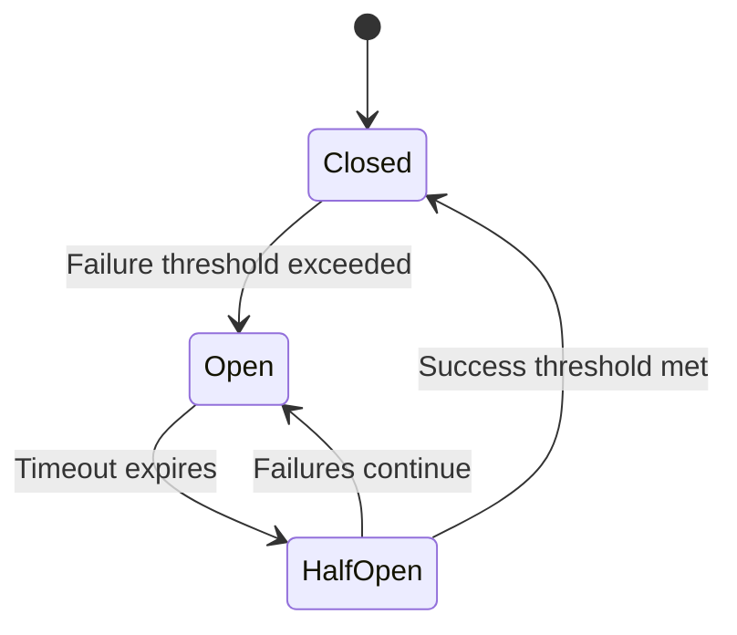

# Circuit Breaker

Circuit breaker is an advanced reliability feature that automatically detects unhealthy endpoints and prevents repeated failed delivery attempts, protecting your system from cascading failures.

## Overview

The circuit breaker implements a three-state pattern to intelligently manage endpoint health:

- **Closed** (Normal): All requests flow through normally
- **Open** (Tripped): Requests are blocked to prevent further failures
- **Half-Open** (Recovery): Limited requests allowed to test if the endpoint has recovered



## How It Works

### State Transitions

1. **Closed ’ Open (Tripping)**
   - Triggers when failure rate exceeds the configured threshold
   - Requires minimum request count to be met
   - Example: With 70% threshold and 10 minimum requests, 7 out of 10 failures will trip the breaker

2. **Open ’ Half-Open (Recovery Mode)**
   - Automatically transitions after the configured timeout period
   - Allows limited requests to test endpoint health

3. **Half-Open ’ Closed (Reset)**
   - Occurs when success rate meets the threshold
   - Endpoint returns to normal operation

4. **Consecutive Failures (Disable)**
   - After repeated circuit breaker trips, the endpoint is automatically disabled
   - Notifications are sent to endpoint contacts and project owners

### Monitoring Window

The circuit breaker continuously monitors endpoint health by:
- Sampling delivery attempts at regular intervals (default: every 30 seconds)
- Analyzing metrics from a rolling time window (default: last 5 minutes)
- Calculating failure and success rates from actual delivery attempts

## Configuration

Circuit breaker settings can be configured at the project level. Each setting controls different aspects of the circuit breaker behavior.

### Configuration Options

| Setting | Default | Description |
|---------|---------|-------------|
| `sample_rate` | 30 seconds | How often to poll and evaluate endpoint metrics |
| `error_timeout` | 30 seconds | Wait time before transitioning from Open to Half-Open |
| `failure_threshold` | 70% | Percentage of failures that triggers the circuit breaker |
| `success_threshold` | 5% | Percentage of successes needed to close from Half-Open |
| `minimum_request_count` | 10 | Minimum requests needed before evaluating thresholds |
| `observability_window` | 5 minutes | Time window to analyze for calculating failure rates |
| `consecutive_failure_threshold` | 10 | Number of consecutive trips before disabling the endpoint |

### Configuration Priority

Circuit breaker configuration is resolved in this order:
1. **Project-level configuration** - Custom settings for your project
2. **Application-level configuration** - System-wide defaults
3. **Hardcoded defaults** - Fallback values

### Validation Rules

When configuring circuit breaker settings, the following rules apply:

- `sample_rate` must be greater than 0
- `error_timeout` must be greater than 0
- `failure_threshold` must be between 1-100
- `success_threshold` must be between 1-100
- `minimum_request_count` must be at least 10
- `observability_window` must be greater than 0
- `observability_window * 60` must be greater than `sample_rate`
- `consecutive_failure_threshold` must be greater than 0

## Usage Examples

### Example 1: Standard Configuration

For a typical webhook endpoint with moderate traffic:

```json
{
  "sample_rate": 30,
  "failure_threshold": 70,
  "success_threshold": 10,
  "minimum_request_count": 10,
  "observability_window": 5,
  "error_timeout": 60,
  "consecutive_failure_threshold": 10
}
```

This configuration:
- Checks endpoint health every 30 seconds
- Trips the breaker if 70% of requests fail (minimum 10 requests)
- Requires 10% success rate to recover
- Disables endpoint after 10 consecutive circuit breaker trips

### Example 2: Aggressive Protection

For critical systems requiring fast failure detection:

```json
{
  "sample_rate": 15,
  "failure_threshold": 50,
  "success_threshold": 20,
  "minimum_request_count": 10,
  "observability_window": 3,
  "error_timeout": 30,
  "consecutive_failure_threshold": 5
}
```

This configuration:
- Checks more frequently (every 15 seconds)
- Lower failure tolerance (50%)
- Requires higher success rate to recover (20%)
- Disables endpoint faster (after 5 trips)

### Example 3: Lenient Configuration

For endpoints with acceptable occasional failures:

```json
{
  "sample_rate": 60,
  "failure_threshold": 85,
  "success_threshold": 5,
  "minimum_request_count": 20,
  "observability_window": 10,
  "error_timeout": 120,
  "consecutive_failure_threshold": 15
}
```

This configuration:
- Checks less frequently (every 60 seconds)
- Higher failure tolerance (85%)
- Easier recovery (5% success)
- More patient with repeated failures (15 trips before disable)

## Managing Circuit Breakers

### Viewing Circuit Breaker State

You can check the current state of a circuit breaker for any endpoint using the CLI:

```bash
convoy circuit-breakers get <endpoint-id>
```

This returns detailed information including:
- Current state (Closed, Open, or Half-Open)
- Request counts and rates
- Consecutive failure count
- Next reset time (if applicable)

### Updating Configuration

To update circuit breaker configuration for a specific endpoint:

```bash
convoy circuit-breakers update <endpoint-id> \
  --failure_threshold 75 \
  --success_threshold 10 \
  --minimum_request_count 15 \
  --observability_window 10 \
  --consecutive_failure_threshold 8
```

## Notifications

When circuit breaker thresholds are exceeded, Convoy automatically sends notifications to:
- Endpoint support contacts
- Project owners

Notifications are rate-limited to prevent alert fatigue (maximum 3 notifications per circuit breaker).

## Best Practices

1. **Start with defaults**: The default configuration works well for most use cases
2. **Monitor your metrics**: Review delivery attempts before tuning thresholds
3. **Consider traffic patterns**: High-traffic endpoints may need lower minimum_request_count
4. **Balance recovery time**: Longer `error_timeout` gives endpoints more recovery time but delays legitimate traffic
5. **Set appropriate windows**: `observability_window` should capture meaningful traffic patterns
6. **Test your configuration**: Use lower thresholds in staging to verify behavior

## Troubleshooting

### Circuit Breaker Not Triggering

- Verify `minimum_request_count` is being met in the `observability_window`
- Check that failure rate actually exceeds `failure_threshold`
- Ensure circuit breaker feature is enabled in your license
- Confirm the feature flag is enabled for your deployment

### Endpoint Disabled Unexpectedly

- Review `consecutive_failure_threshold` - may be too low for your use case
- Check delivery attempt logs for underlying endpoint issues
- Verify endpoint is actually healthy and reachable
- Consider increasing `error_timeout` to allow more recovery time

### Circuit Breaker Not Resetting

- Ensure endpoint is returning successful responses (2xx status codes)
- Verify `success_threshold` is achievable with current traffic
- Check that requests are being allowed through in Half-Open state
- Review delivery attempt metrics during recovery period

## Technical Details

### Storage

Circuit breaker state is stored in Redis with automatic expiration matching the observability window. The state includes:
- Current state (Closed/Open/Half-Open)
- Request counts and rates
- Consecutive failure counter
- Reset timestamps
- Notification history

### Metrics Source

The circuit breaker analyzes actual delivery attempts from the database, querying:
- Delivery success and failure counts
- Grouped by endpoint and project
- Within the configured observability window

### High Availability

Circuit breaker sampling uses distributed locking to ensure:
- Only one instance samples at a time across your deployment
- Lock TTL matches the sample rate
- Automatic failover if a sampler crashes

## Feature Requirements

Circuit breaker requires:
- Feature flag `CircuitBreaker` enabled
- License with Circuit Breaking capability
- Redis for state storage
- Background worker process running
