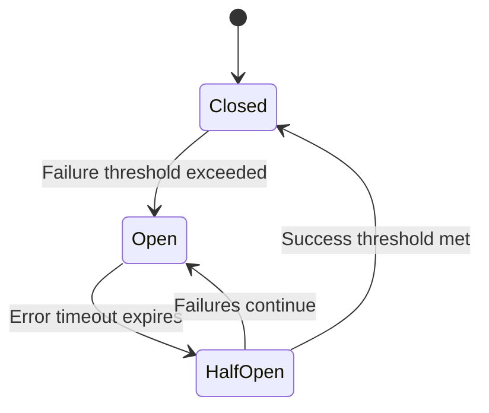

This is an advanced reliability feature that automatically detects unhealthy endpoints and prevents repeated failed delivery attempts, protecting your system from cascading failures.

> **Note:**
> - The circuit breaker functionality is available only for licensed users with Circuit Breaking capability.
> - This feature is disabled by default. To enable it, use the environment variable `CONVOY_ENABLE_FEATURE_FLAG=circuit-breaker` or the CLI flag `--enable-feature-flag=circuit-breaker`.
> - Requires Redis for state storage and a running background worker process.

## Overview

The circuit breaker implements a three-state pattern to intelligently manage endpoint health:

- **Closed** (Normal): All requests flow through normally
- **Open** (Tripped): Requests are blocked to prevent further failures
- **Half-Open** (Recovery): Limited requests allowed to test if the endpoint has recovered



## How It Works

### State Transitions

1. **Closed → Open (Tripping)**
    - Triggers when the failure rate exceeds the configured threshold
    - Requires a minimum request count to be met
    - Example: With a 70% threshold and 10 minimum requests, 7 out of 10 failures will trip the breaker

2. **Open → Half-Open (Recovery Mode)**
    - Automatically transitions after the configured timeout period
    - Allows limited requests to test endpoint health

3. **Half-Open → Closed (Reset)**
    - Occurs when the success rate meets the threshold
    - Endpoint returns to normal operation

4. **Consecutive Failures (Disable)**
    - After repeated circuit breaker trips, the endpoint is automatically disabled
    - Notifications are sent to endpoint contacts and project owners

### Monitoring Window

The circuit breaker continuously monitors endpoint health by:
- Sampling delivery attempts at regular intervals (default: every 30 seconds)
- Analyzing metrics from a rolling time window (default: last 5 minutes)
- Calculating failure and success rates from actual delivery attempts

**How the Observability Window Affects Tripping Speed:**

The `observability_window` setting directly impacts how quickly a circuit breaker can trip:

- **Shorter window (e.g., 3 minutes)**: Faster response to failures, but more sensitive to temporary issues
- The breaker only needs enough failures within 3 minutes to meet the threshold
- Example: 10 failures in 3 minutes = faster trip

- **Longer window (e.g., 10 minutes)**: Slower to trip, but more stable and less prone to false positives
- Requires sustained failures over a longer period
- Example: 10 failures must occur across 10 minutes = slower trip

**Important Timing Considerations:**

1. **Minimum requests must accumulate**: The `minimum_request_count` must be reached within the `observability_window` for evaluation
    - Example problem: `5 req/min` traffic with `minimum_request_count = 10` and `observability_window = 1 minute` will never trip because it can't reach 10 requests
    - Example solution: Increase `observability_window` to 5 minutes to allow accumulation

2. **Sample rate vs observability window**: The `sample_rate` determines how often the circuit breaker checks, while `observability_window` determines the data it analyzes
    - Checking every 30 seconds with a 5-minute window means each check analyzes the last 5 minutes of data
    - A longer `sample_rate` delays detection but reduces system load
    - A shorter `sample_rate` enables faster detection but increases processing frequency

## Configuration

Circuit breaker settings can be configured per project. Each setting controls different aspects of the circuit breaker's behavior.

### Configuration Options

| Setting                         | Default    | Description                                                                                            |
|---------------------------------|------------|--------------------------------------------------------------------------------------------------------|
| `sample_rate`                   | 30 seconds | How often to poll and evaluate endpoint metrics                                                        |
| `error_timeout`                 | 30 seconds | Wait time before transitioning from Open to Half-Open                                                  |
| `failure_threshold`             | 70%        | Percentage of failures that triggers the circuit breaker                                               |
| `success_threshold`             | 5%         | Percentage of successes needed to close from Half-Open                                                 |
| `minimum_request_count`         | 10         | Minimum requests needed before evaluating thresholds                                                   |
| `observability_window`          | 5 minutes  | Rolling time window for calculating failure rates. **Shorter = faster tripping, Longer = more stable** |
| `consecutive_failure_threshold` | 10         | Number of consecutive trips before disabling the endpoint                                              |

### Configuration Priority

Circuit breaker configuration is resolved in this order:
1. **Project-level configuration** - Custom settings for your project
2. **Application-level configuration** - System-wide defaults
3. **Hardcoded defaults** - Fallback values

## Usage Examples

### Example 1: Standard Configuration

For a typical webhook endpoint with moderate traffic:

```json
{
  "sample_rate": 30,
  "failure_threshold": 70,
  "success_threshold": 10,
  "minimum_request_count": 10,
  "observability_window": 5,
  "error_timeout": 60,
  "consecutive_failure_threshold": 10
}
```

This configuration:
- Checks endpoint health every 30 seconds
- Trips the breaker if 70% of requests fail (minimum 10 requests)
- Requires 10% success rate to recover
- Disables endpoint after 10 consecutive circuit breaker trips

**Timing behavior**: With a 5-minute observability window, the breaker needs at least 10 failed requests within the last 5 minutes to evaluate. This provides a balanced approach - responsive enough to catch issues quickly, but stable enough to avoid false positives from brief outages.

### Example 2: Aggressive Protection

For critical systems requiring fast failure detection:

```json
{
  "sample_rate": 15,
  "failure_threshold": 50,
  "success_threshold": 20,
  "minimum_request_count": 10,
  "observability_window": 3,
  "error_timeout": 30,
  "consecutive_failure_threshold": 5
}
```

This configuration:
- Checks more frequently (every 15 seconds)
- Lower failure tolerance (50%)
- Requires a higher success rate to recover (20%)
- Disables endpoint faster (after 5 trips)

**Timing behavior**: With a 3-minute observability window, the breaker can trip very quickly—it only needs 5 out of 10 requests to fail within 3 minutes to trip. This aggressive setup is ideal for protecting critical systems where you want to fail fast and prevent cascading issues. The trade-off is higher sensitivity to temporary problems.

### Example 3: Lenient Configuration

For endpoints with acceptable occasional failures:

```json
{
  "sample_rate": 60,
  "failure_threshold": 85,
  "success_threshold": 5,
  "minimum_request_count": 20,
  "observability_window": 10,
  "error_timeout": 120,
  "consecutive_failure_threshold": 15
}
```

This configuration:
- Checks less frequently (every 60 seconds)
- Higher failure tolerance (85%)
- Easier recovery (5% success)
- More lenient with repeated failures (15 trips before endpoints are disabled)

**Timing behavior**: With a 10-minute observability window, the breaker requires sustained failures over a longer period before tripping. You need 20 requests with 85% failures within 10 minutes. This conservative approach is ideal for endpoints that experience occasional issues but generally recover on their own. The breaker will only trip during prolonged outages, minimizing false alarms.

## Updating Disabled Endpoints

Endpoints that are [disabled (inactive)](/product-manual/endpoints#endpoint-state) due to consecutive failures can be re-enabled on the dashboard.


## Managing Circuit Breakers

### Viewing Circuit Breaker State

You can check the current state of a circuit breaker for any endpoint using the CLI:

```bash
convoy circuit-breakers get <endpoint-id>
```

This returns detailed information including:
- Current state (Closed, Open, or Half-Open)
- Request counts and rates
- Consecutive failure count
- Next reset time (if applicable)

### Updating Configuration

To update circuit breaker configuration for a specific endpoint:

```bash
convoy circuit-breakers update <endpoint-id> \
  --failure_threshold 75 \
  --success_threshold 10 \
  --minimum_request_count 15 \
  --observability_window 10 \
  --consecutive_failure_threshold 8
```

## Notifications

When circuit breaker thresholds are exceeded, Convoy automatically sends notifications to:
- Endpoint support contacts
- Project owners

Notifications are rate-limited to prevent alert fatigue (maximum 3 notifications per circuit breaker).

## Best Practices

1. **Start with defaults**: The default configuration works well for most use cases

2. **Monitor your metrics**: Review delivery attempts before tuning thresholds

3. **Calculate your timing requirements**: Consider how quickly you need to detect and respond to failures
- **Example**: If your endpoint receives 2 requests per minute and you want to detect failures within 10 minutes:
- `observability_window`: 10 minutes (detection timeframe)
- `minimum_request_count`: 10-20 (achievable with 2 req/min × 10 min = 20 requests)
- Expected trip time: 5-10 minutes after failures start

- **Example**: For high-traffic endpoints (100 requests per minute) requiring fast detection:
- `observability_window`: 2 minutes (quick detection)
- `minimum_request_count`: 50 (easily met with 100 req/min × 2 min = 200 requests)
- Expected trip time: 1-2 minutes after failures start

4. **Match window to traffic volume**: Ensure `minimum_request_count` can be reached within `observability_window`
- Low traffic (< 5 req/min): Use longer windows (10+ minutes)
- Medium traffic (5-50 req/min): Use moderate windows (5-10 minutes)
- High traffic (> 50 req/min): Can use shorter windows (2-5 minutes)

5. **Balance recovery time**: Longer `error_timeout` gives endpoints more recovery time but delays legitimate traffic

6. **Test your configuration**: Use lower thresholds in staging to verify behavior and measure actual trip times

## Troubleshooting

### Circuit Breaker Not Triggering

- Verify `minimum_request_count` is being met in the `observability_window`
- Check that failure rate actually exceeds `failure_threshold`
- Ensure the circuit breaker feature is enabled in your license
- Confirm the feature flag is enabled for your deployment

### Endpoint Disabled Unexpectedly

- Review `consecutive_failure_threshold` - may be too low for your use case
- Check delivery attempt logs for underlying endpoint issues
- Verify endpoint is actually healthy and reachable
- Consider increasing `error_timeout` to allow more recovery time

### Circuit Breaker Not Resetting

- Ensure endpoint is returning successful responses (2xx status codes)
- Verify `success_threshold` is achievable with current traffic
- Check that requests are being allowed through in Half-Open state
- Review delivery attempt metrics during recovery period

## Technical Details

### Storage

Circuit breaker state is stored in Redis with automatic expiration matching the observability window. The state includes:
- Current state (Closed/Open/Half-Open)
- Request counts and rates
- Consecutive failure counter
- Reset timestamps
- Notification history

### Metrics Source

The circuit breaker analyzes actual delivery attempts from the database, querying:
- Delivery success and failure counts from recent delivery attempts
- Grouped by endpoint and project
- Within the configured observability window

This gives the circuit breaker a real-time view of endpoint health.

### High Availability

Circuit breaker sampling uses distributed locking to ensure:
- Only one convoy agent instance samples at a time across your deployment
- The Lock TTL matches the sample rate
- Automatically fails-open if a sampler crashes

## Enabling The Circuit Breaker (Self-Hosted)

### Using Environment Variable

Set the feature flag when starting Convoy:

```shell
CONVOY_ENABLE_FEATURE_FLAG=circuit-breaker convoy server --config convoy.json
```

### Using CLI Flag

Alternatively, enable the feature using the CLI flag:

```shell
convoy server --config convoy.json --enable-feature-flag=circuit-breaker
```

### Docker Deployment

For Docker deployments, pass the environment variable:

```shell
docker run -e CONVOY_ENABLE_FEATURE_FLAG=circuit-breaker getconvoy/convoy:latest
```

## Enabling The Circuit Breaker (Cloud)

The circuit breaker is enabled by default in Convoy Cloud. If you want to configure it based on your use case, please reach out to us on slack or via email.
